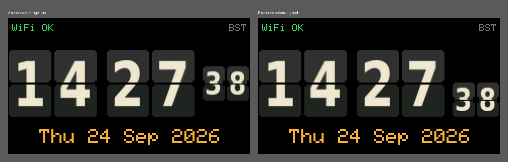

# T-Display Flip Clock

An NTP-synchronised clock for the LilyGO T-Display (ESP32 with a 1.14" 135×240 ST7789 LCD). It connects to WiFi, gets the time from an NTP server and shows it as a retro split-flap clock with an animated flip whenever a digit changes.



## Features

- Time from NTP (`pool.ntp.org` by default), re-synced every hour
- Timezone with automatic daylight saving (UK time by default)
- Flip cards with anti-aliased digits and a fold-down animation
- On-device settings menu for the digit, card and date colours, brightness and 12/24-hour time. Settings are kept across power cycles
- WiFi status and timezone (GMT/BST) along the top, date underneath

## Hardware

LilyGO T-Display, original ESP32 version. The T-Display-S3 uses a different chip and display interface and will not work with this code.

| Function | GPIO |
|---|---|
| LCD MOSI / SCLK / CS / DC / RST | 19 / 18 / 5 / 16 / 23 |
| LCD backlight | 4 |
| Button: MENU | 0 (also BOOT) |
| Button: CHANGE | 35 |

Holding GPIO0 while the board resets puts it into download mode instead of starting the clock.

## Getting started

Requires ESP-IDF v6.1.

1. Set up the ESP-IDF environment (this is the `get_idf` alias):
   ```bash
   . ~/esp/esp-idf/export.sh
   ```
2. Add your WiFi details:
   ```bash
   cp main/secrets.example.h main/secrets.h
   ```
   Then edit `main/secrets.h`. It is git-ignored, so the credentials stay out of version control.
3. Optionally, change the settings (see below):
   ```bash
   idf.py menuconfig
   ```
4. Build, flash and watch the log (press Ctrl+] to exit the monitor):
   ```bash
   idf.py -p /dev/ttyUSB0 flash monitor
   ```

## Settings menu

The buttons do nothing during normal use, so a stray press can't change anything.

| Action | What it does |
|---|---|
| Hold MENU (0.8 s) | Open the settings menu. A yellow bar at the top shows the item being edited and its value |
| Press MENU | Go to the next item: Digits → Cards → Date → Brightness → Clock |
| Press CHANGE | Step the value forwards. Changes show straight away |
| Hold CHANGE | Step the value backwards |
| Hold MENU again | Save and close. The menu also saves and closes after 10 seconds without a press |

| Item | Values |
|---|---|
| Digits, Cards, Date | Any colour from the shared palette in `main/palette.c` |
| Brightness | 10%, 25%, 50%, 75%, 100% |
| Clock | 24 hour or 12 hour. 12-hour mode leaves the leading card blank and shows AM/PM |

Settings are stored in NVS under the `settings` namespace. Colours are saved by their id (for example `purple`), so adding or reordering colours in the palette never changes a saved choice.

## Build settings

Under **NTP Clock Configuration** in `idf.py menuconfig`:

| Setting | Default | Notes |
|---|---|---|
| NTP server | `pool.ntp.org` | |
| Timezone | `GMT0BST,M3.5.0/1,M10.5.0` | POSIX TZ string. The help text has examples for other regions |
| Centre seconds cards on the hinge line | off | On gives layout A in the image above; off gives layout B |

Settings are compiled into the firmware, so reflash after changing them.

### How the timezone string works

`GMT0BST,M3.5.0/1,M10.5.0` means:

- `GMT0`: standard time is called GMT and is UTC+0. The offset is what you add to local time to get UTC, so New York is `EST5`.
- `BST`: summer time is called BST and is one hour ahead of standard time.
- `M3.5.0/1`: BST starts in month 3 (March), in week 5 (which always means the last week), on day 0 (Sunday), at 01:00.
- `M10.5.0`: BST ends on the last Sunday in October, at the default time of 02:00 local.

## Project layout

| File | Purpose |
|---|---|
| `main/main.c` | WiFi, SNTP, main loop, screen layout, settings menu |
| `main/flip_clock.c` | Flip card drawing, animation, 12/24-hour digits |
| `main/palette.c` | Shared colour list with a stable id for each colour |
| `main/settings.c` | `clock_settings_t` defaults, NVS load and save |
| `main/display.c` | ST7789 driver setup, frame buffer, backlight PWM, 5×7 text font |
| `main/buttons.c` | Button polling task, with debouncing and short/long press detection |
| `main/flip_font.h` | Generated digit bitmaps. Do not edit by hand |
| `tools/gen_flip_font.py` | Generates `flip_font.h` |
| `main/Kconfig.projbuild` | The menuconfig settings above |

## Regenerating the digit font

The digits are pre-rendered from DejaVu Sans Condensed Bold into `main/flip_font.h`. The build does not regenerate them. To change the font or card size, edit `tools/gen_flip_font.py` and run:

```bash
pip install pillow
python3 tools/gen_flip_font.py
```

## Resource usage

These were measured with layout A. The layout option does not change them.

- **Flash:** about 885 KB of the 1 MB app partition. Most of it is the WiFi and TCP/IP stacks; the digit bitmaps are 36 KB.
- **RAM:** about 155 KB of heap free while running. The 65 KB frame buffer has already been taken out of that.
- **CPU:** about 11 ms to draw each animation frame and 18 ms to send it to the screen by DMA (the CPU is free during the transfer). That comes to roughly 5% of the dual-core chip.

## Licence and credits

This project is released under the [MIT Licence](LICENSE).

It includes material from other projects under their own licences:

- **5×7 text font** in `main/display.c`: from the [Adafruit GFX Library](https://github.com/adafruit/Adafruit-GFX-Library) (`glcdfont.c`), Copyright (c) 2012 Adafruit Industries, BSD licence.
- **Flip card digits** in `main/flip_font.h`: rendered from DejaVu Sans Condensed Bold. [DejaVu fonts](https://dejavu-fonts.github.io/) are based on Bitstream Vera, Copyright (c) 2003 Bitstream, Inc., and are distributed under the Bitstream Vera Fonts licence.
